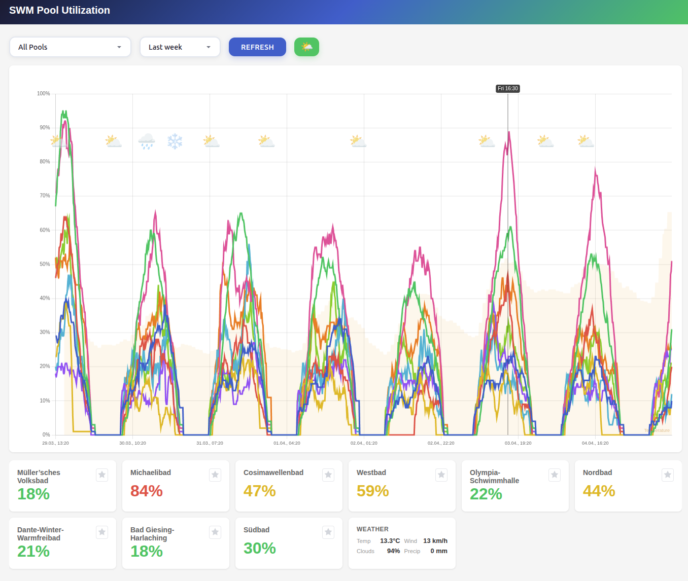
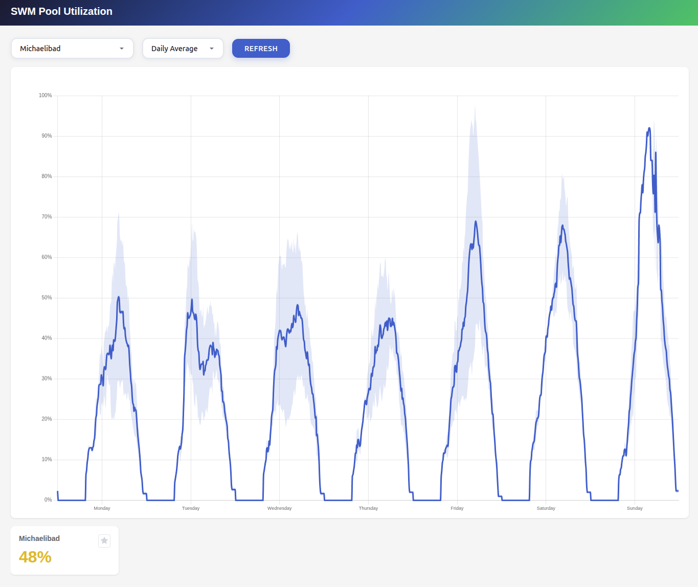

# SWM Pool Utilization Monitor

A monitoring application that tracks historical pool utilization from SWM (Stadtwerke München) swimming pools and correlates it with weather conditions. The dashboard provides insights into how weather affects pool attendance.

[](http://grid.resolve.bar:8086/)

### Average Utilization Statistics


The daily average view derives aggregated statistics from all available historical data.


## Quick Start

```bash
./start.sh
```

This will:
1. Initialize the SQLite database with required tables (via `db-init` service)
2. Build all Docker images
3. Start all services

See the `Backend maintenance` section below for troubleshooting setup. First time setup may require manual data collection and aggregations services manually, to fill gaps in the backend datastore due to delayed scheduled service execution.

## Dashboard

### Chart
- **Pool utilization** — one coloured line per pool showing utilization (%) over time
- **Temperature** — subtle amber area chart indicating temperature (normalized to the 0–100% axis, range –10°C to 35°C)
- **Weather icon** — emoji icons, shown at weather-state change points:
  - Clear / ⛅ Partly cloudy / ☁️ Cloudy / 🌧️ Rain / 🌦️ Drizzle / ❄️ Snow / 🌨️ Sleet / ⛈️ Thunderstorm / 🌫️ Fog
  - 💨 Wind spike (≥15 km/h) / 🌬️ Very strong wind (≥30 km/h)

### Weather toggle
The toolbar button (☁️ / 🌤️) toggles weather overlays on/off:
- Enables/disables the temperature area fill in the chart
- Shows/hides weather icons on the chart
- Shows/hides the weather tile in the pool card list

### Daily Statistics
The "Daily Average" option shows the **recurring weekly utilization pattern**:
- In _single-pool mode_, the confidence-interval band (mean ± 1σ) highlights utilization variability
- The statistics tile shows data coverage: 
  - **Coverage** (historic time horizon taken into account for the statistics calculation)
  - **Samples** (total measurements)
  - **Last Update** (last cache refresh)

### Pool cards
- One card per pool showing the current (or hovered) utilization percentage
- Colour-coded: green < 40%, yellow 40–70%, red > 70%
- Star button to mark a favourite pool

### Weather tile
- Shows four metrics for the current or hovered timestamp: **Temp**, **Wind**, **Clouds**, **Precip**
- Wind speed is highlighted in red when ≥ 15 km/h

## Services

| Service | Technology | Description |
|---------|------------|-------------|
| **api** | Go/Gin | REST API serving pool utilization and weather data |
| **pool-scraper** | Go | Collects real-time utilization data from the SWM website |
| **weather-scraper** | Go | Collects weather data from Open-Meteo API |
| **daily-avg-aggregator** | Go | Computes and caches daily average statistics |
| **frontend** | Vue.js | Dashboard with historical charts and weather overlay |

### Configuration

| Service | Setting | Default | Description |
|---------|---------|---------|-------------|
| db-init | — | once | One-time setup: creates database file and tables (runs on first `./start.sh`) |
| pool-scraper | interval | 10 min | Pool data fetch frequency |
| weather-scraper | interval | 1 hour | Weather data fetch frequency |
| daily-avg-aggregator | interval | 1 hour | Daily average cache refresh frequency |
| api | port | 8085 | REST API port |
| frontend | port | 8086 | Dashboard port |

## Data Sources

### Pool Utilization
Scrapes real-time utilization ("Auslastung") from [SWM Bäder](https://www.swm.de/baeder/auslastung).
- Sampling frequency **10 minutes**
- Collects utilization percentage for each pool

### Weather Data
Fetches current weather conditions from [Open-Meteo API](https://open-meteo.com/) for Munich coordinates (48.1372°N, 11.5755°E).
- Sampling frequency **1 hour**
- Records temperature, wind speed/direction, precipitation, cloud cover, and weather type

### Timezone Handling

| Layer | Format | Timezone | Example |
|-------|--------|----------|---------|
| SWM website (source) | — | Europe/Berlin | "10:30" (local wall-clock) |
| Open-Meteo API (source) | ISO 8601 | Europe/Berlin (requested via `&timezone=`) | `2026-04-06T10:30` |
| SQLite storage (`dtime`) | `YYYY-MM-DD HH:MM:SS` | UTC | `2026-04-06 08:30:00` |
| Aggregator (slot computation) | `time.Time` → slot index | UTC → Europe/Berlin via `time.In()` | slot 189 = Mon 07:30 Berlin |
| REST API output | RFC 3339 | Europe/Berlin (with UTC offset) | `2026-04-06T10:30:00+02:00` |
| Frontend display | `toLocaleString` | Europe/Berlin (pinned via `timeZone`) | `06.04., 10:30` |

## API Endpoints

| Endpoint | Description |
|----------|-------------|
| `GET /api/health` | Health check |
| `GET /api/pools` | List all tracked pools |
| `GET /api/history?days=1` | Get pool history (default: 24 hours) |
| `GET /api/history?pool=X&days=30` | Filter by specific pool |
| `GET /api/weather?days=1` | Get weather history (default: 24 hours) |
| `GET /api/daily-avg` | Get cached daily average statistics |
| `GET /api/daily-avg?pool=X` | Get cached daily average statistics for a specific pool |

## Data Storage

SQLite database stored in a Docker volume (`db_data`), which is mounted to the host system at `/var/lib/docker/volumes/swm_pool_utility_db_data/_data`.

### Tables

**track_pools**
| Column | Type | Description |
|--------|------|-------------|
| name | VARCHAR | Pool name |
| dtime | DATETIME | Timestamp of measurement |
| utility | INT | Utilization percentage (0-100) |

**weather**
| Column | Type | Description |
|--------|------|-------------|
| dtime | DATETIME | Timestamp of measurement |
| temperature | REAL | Temperature in °C |
| wind_speed | REAL | Wind speed in km/h |
| wind_direction | REAL | Wind direction in degrees |
| precipitation | REAL | Precipitation in mm |
| cloud_cover | INT | Cloud cover percentage (0-100) |
| weather_code | INT | WMO weather code |
| weather_type | VARCHAR | Simplified weather type (clear, partly_cloudy, cloudy, rain, drizzle, snow, sleet, thunderstorm, fog) |

**daily_avg_cache**
| Column | Type | Description |
|--------|------|-------------|
| pool_name | VARCHAR | Pool name |
| slot_index | INT | Time slot index (0–1007, representing Mon 00:00 to Sun 23:50 in 10-min steps) |
| mean_utilization | REAL | Mean utilization percentage for this pool and slot |
| std_dev | REAL | Population standard deviation |
| sample_count | INT | Number of data points contributing to the mean |
| updated_at | DATETIME | Timestamp of the last cache refresh |

## Backend Maintenance

The SQLite database is stored in a Docker volume (`db_data`). Use the following commands to back up and restore.

### Backup

```bash
# Copy the database file from the volume to the host
docker cp swm_pool_utility-api-1:/data/swm_pool_utility.db ./backup.db
```

### Restore

```bash
# Verify host volume mount point
docker volume inspect swm_pool_utility_db_data --format '{{ .Mountpoint }}'

# Stop the containers to ensure file consistency
docker compose stop api pool-scraper weather-scraper daily-avg-aggregator

# Replace the .db file on the hosts docker volume mount point
cp ./backup.db $(docker volume inspect swm_pool_utility_db_data --format '{{ .Mountpoint }}')/swm_pool_utility.db

# Restart services
docker compose start api pool-scraper weather-scraper daily-avg-aggregator
```

### Trigger Average Statistics Update

```bash
# Run backend statistics updater manually
docker compose exec daily-avg-aggregator /app/aggregator --once
```
