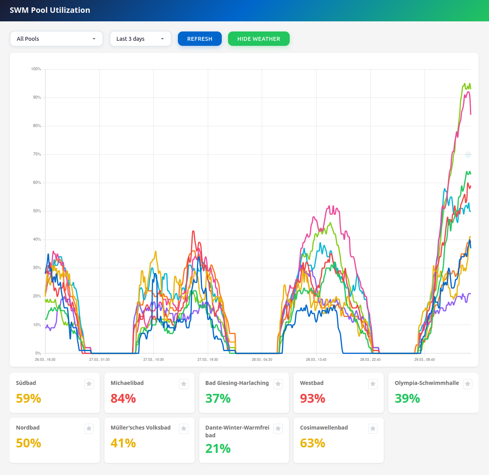

# SWM Pool Utilization Monitor

A monitoring application that tracks historical pool utilization from SWM (Stadtwerke München) swimming pools and correlates it with weather conditions. The dashboard provides insights into how weather affects pool attendance.

[](http://grid.resolve.bar:8086/)


## Services

| Service | Technology | Description |
|---------|------------|-------------|
| **api** | Go/Gin | REST API serving pool utilization and weather data |
| **pool-scraper** | Go | Collects real-time utilization data from the SWM website |
| **weather-scraper** | Go | Collects weather data from Open-Meteo API |
| **frontend** | Vue.js | Dashboard with historical charts and weather overlay |
| **db-init** | Debian | One-time setup: creates database file and tables (runs on first `./start.sh`) |

### Configuration

| Service | Setting | Default | Description |
|---------|---------|---------|-------------|
| pool-scraper | interval | 10 min | Scrape frequency |
| weather-scraper | interval | 1 hour | Weather fetch frequency |
| api | port | 8085 | REST API port |
| frontend | port | 8086 | Dashboard port |


## Quick Start

```bash
./start.sh
```

This will:
1. Initialize the SQLite database with required tables (via `db-init` service)
2. Build all Docker images
3. Start all services

## Data Sources

### Pool Utilization
Scrapes real-time utilization ("Auslastung") from [SWM Bäder](https://www.swm.de/baeder/auslastung).
- Runs every **10 minutes**
- Collects utilization percentage (0-100%) for each Munich pool
- Excludes sauna and steam bath facilities

### Weather Data
Fetches current weather conditions from [Open-Meteo API](https://open-meteo.com/) for Munich coordinates (48.1372°N, 11.5755°E).
- Runs every **1 hour**
- Records temperature, wind speed/direction, precipitation, cloud cover, and weather type

## API Endpoints

| Endpoint | Description |
|----------|-------------|
| `GET /api/health` | Health check |
| `GET /api/pools` | List all tracked pools |
| `GET /api/history?days=7` | Get pool history (default: 7 days) |
| `GET /api/history?pool=X&days=30` | Filter by specific pool |
| `GET /api/weather?days=7` | Get weather history (default: 7 days) |

## Dashboard Features

### Chart
- **Pool utilization lines** — one coloured line per pool showing utilization (%) over time
- **Temperature fill** — subtle amber area chart behind the lines indicating temperature (normalized to the 0–100% axis, range –10°C to 35°C); labelled "Temperature" in the bottom-right corner of the chart
- **Vertical crosshair** — follows the cursor and shows the time at the top of the line
- **Weather icon overlay** — emoji icons placed in the top 30% of the chart, shown only at weather-state change points:
  - ☀️ Clear / ⛅ Partly cloudy / ☁️ Cloudy / 🌧️ Rain / 🌦️ Drizzle / ❄️ Snow / 🌨️ Sleet / ⛈️ Thunderstorm / 🌫️ Fog
  - 💨 Wind spike (≥15 km/h) / 🌬️ Very strong wind (≥30 km/h)
  - Icons are only placed when the weather state **changes**; nearby events are merged to avoid crowding

### Weather toggle
The toolbar button (☁️ / 🌤️) toggles weather overlays on/off:
- Enables/disables the temperature area fill in the chart
- Shows/hides weather emoji icons on the chart
- Shows/hides the weather tile in the pool card list
- State is persisted in `localStorage`

### Pool cards
- One card per pool showing the current (or hovered) utilization percentage
- Colour-coded: green < 40%, yellow 40–70%, red > 70%
- Star button to mark a pool as favourite (persisted in a cookie); favourited pool is pre-selected on next visit
- Cards update in real-time as the cursor moves over the chart

### Weather tile
- Displayed at the end of the pool card list when weather overlay is active
- Shows four metrics for the current or hovered timestamp: **Temp**, **Wind**, **Clouds**, **Precip**
- Wind speed is highlighted in red when ≥ 15 km/h
- Updates live as the cursor moves over the chart; falls back to the most recent weather entry when not hovering

## Data Storage

SQLite database stored in a Docker volume (`db_data`), which is mounted to the host system at `/var/lib/docker/volumes/swm_pool_utility_db_data/_data`.

### Tables

**track_pools**
| Column | Type | Description |
|--------|------|-------------|
| name | VARCHAR | Pool name |
| dtime | DATETIME | Timestamp of measurement |
| utility | INT | Utilization percentage (0-100) |

**weather**
| Column | Type | Description |
|--------|------|-------------|
| dtime | DATETIME | Timestamp of measurement |
| temperature | REAL | Temperature in °C |
| wind_speed | REAL | Wind speed in km/h |
| wind_direction | REAL | Wind direction in degrees |
| precipitation | REAL | Precipitation in mm |
| cloud_cover | INT | Cloud cover percentage (0-100) |
| weather_code | INT | WMO weather code |
| weather_type | VARCHAR | Simplified weather type (clear, partly_cloudy, cloudy, rain, drizzle, snow, sleet, thunderstorm, fog) |

## Database Backup & Restore

The SQLite database is stored in a Docker volume (`db_data`). Use the following commands to back up and restore.

### Find Volume Mount Point

```bash
# Get the host path of the volume
docker volume inspect swm_pool_utility_db_data --format '{{ .Mountpoint }}'
```

### Backup

```bash
# Copy the database file from the volume to the host
docker cp swm_pool_utility-api-1:/data/swm_pool_utility.db ./backup.db
```

### Restore

```bash
# Stop the containers to ensure file consistency
docker compose stop api pool-scraper weather-scraper

# Replace the .db file on the hosts docker volume mount point
cp ./backup.db $(docker volume inspect swm_pool_utility_db_data --format '{{ .Mountpoint }}')/swm_pool_utility.db

# Restart services
docker compose start api pool-scraper weather-scraper
```
