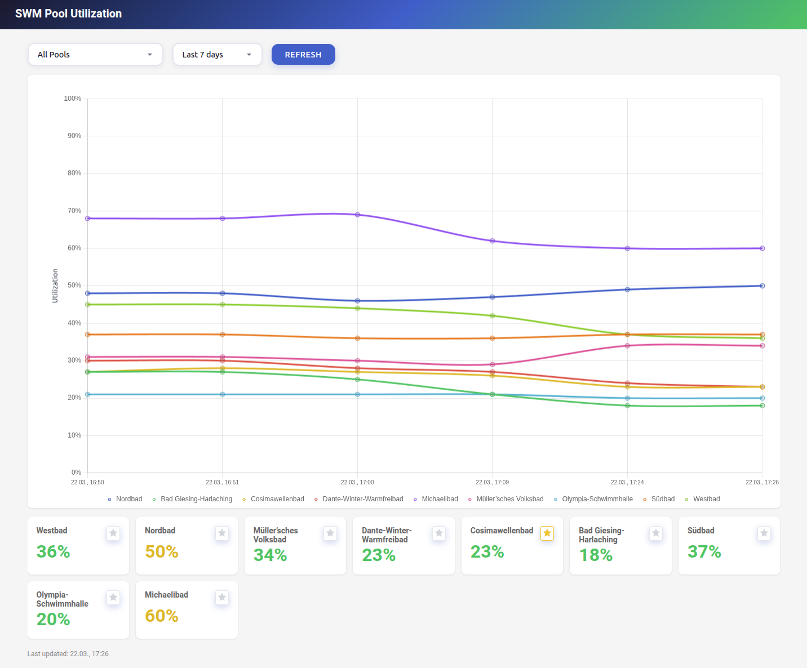

# SWM Pool Utilization Monitor

Monitoring of historical SWM pool utilization. 

[](http://grid.resolve.bar:8086/)


## Services

- **api** - REST API serving historical pool utilization data 
- **scraper** - Scheduled scraper (collects 100-"Auslastung"=utilization from SWM)
- **frontend** - Vue.js dashboard with historical charts

## Quick Start

```bash
./start.sh
```

This will:
1. Initialize the database
2. Build all Docker images
3. (Re-)Start all services


## Configuration

| Service   | Setting        | Default | Description              |
|-----------|----------------|---------|--------------------------|
| scraper   | interval (min) | 10       | Scrape frequency         |


## API Endpoints

| Endpoint | Description |
|----------|-------------|
| `GET /api/pools` | List all pools |
| `GET /api/history?days=7` | Get history (default: 7 days) |
| `GET /api/history?pool=X&days=30` | Filter by pool |

## Data Storage

SQLite database stored in `./data/swm_pool_utility.db`
